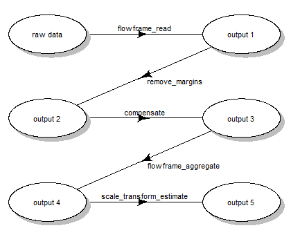

# CytoPipelineGUI : visualization of Flow Cytometry Data Analysis Pipelines run with CytoPipeline

Abstract

This vignette gives a short introduction to CytoPipelineGUI, which is
the companion package of CytoPipeline for interactive visualization of
flow cytometry data pre-processing pipeline results. This vignette is
distributed under a CC BY-SA license.

## Installation

To install this package, start R and enter (uncommented):

``` r

# if (!require("BiocManager", quietly = TRUE))
#     install.packages("BiocManager")
# 
# BiocManager::install("CytoPipelineGUI")
```

## Foreword - Preparation of pipeline results to be visualized

`CytoPipelineGUI` is the companion package of `CytoPipeline`, and is
used for interactive visualization of flow cytometry data pre-processing
pipeline results. It implements two shiny applications :

- a shiny app for interactive comparison of flow frames that are the
  results of CytoProcessingSteps of the same or different CytoPipeline
  experiments.  
  It is launched using the following statement:
  [`CytoPipelineCheckApp()`](https://uclouvain-cbio.github.io/CytoPipelineGUI/reference/CytoPipelineCheckApp.md)
  (see below);

- a shiny app for interactive visualization and manual adjustments of
  scale transformation objects. It is launched using the following
  statement:
  [`ScaleTransformApp()`](https://uclouvain-cbio.github.io/CytoPipelineGUI/reference/ScaleTransformApp.md)
  (see below).

In order to be able to show `CytoPipelineGUI` in action, as a
pre-requisite we need to have created a `CytoPipeline` object, defined
the different pipeline steps, and run the pipeline until completion, so
that all intermediate results can be found on a cache. These preliminary
steps are performed by the preparation code below.

``` r

# raw data
rawDataDir <- system.file("extdata", package = "CytoPipeline")
sampleFiles <- file.path(rawDataDir, list.files(rawDataDir,
                                                pattern = "Donor"))
# output files
workDir <- suppressMessages(base::tempdir())
# pipeline configuration files (in json)
jsonDir <- rawDataDir

# creation of CytoPipeline objects

pipL_PeacoQC <-
  CytoPipeline(file.path(jsonDir, "OMIP021_PeacoQC_pipeline.json"),
               experimentName = "OMIP021_PeacoQC",
               sampleFiles = sampleFiles)

pipL_flowAI <-
  CytoPipeline(file.path(jsonDir, "OMIP021_flowAI_pipeline.json"),
               experimentName = "OMIP021_flowAI",
               sampleFiles = sampleFiles)

# execute PeacoQC pipeline
suppressWarnings(execute(pipL_PeacoQC, rmCache = TRUE, path = workDir))

# execute flowAI pipeline
suppressWarnings(execute(pipL_flowAI, rmCache = TRUE, path = workDir))
```

    ## Quality control for the file: Donor1
    ## 5.46% of anomalous cells detected in the flow rate check. 
    ## 0% of anomalous cells detected in signal acquisition check. 
    ## 0.12% of anomalous cells detected in the dynamic range check.

    ## Quality control for the file: Donor2
    ## 66.42% of anomalous cells detected in the flow rate check. 
    ## 0% of anomalous cells detected in signal acquisition check. 
    ## 0.1% of anomalous cells detected in the dynamic range check.

If you are unfamiliar with `CytoPipeline` package, and you would like to
know more about these steps, it is advised that you read the
`CytoPipeline` vignette, and/or that you watch the videos illustrating
the `CytoPipeline` suite, which are accessible through links included in
the `Demo.Rmd` vignette.

## Introduction

The visualization tools shown here are demonstrated on the results of
two different previously run `CytoPipeline` objects. These flow
cytometry pre-processing pipeline are described in details in the
`CytoPipeline` vignette. Here below is a short summary of the
illustrating dataset, as well as the pipeline steps.

### Example dataset (more details in CytoPipeline vignette)

The example dataset that will be used throughout this vignette is
derived from a reference public dataset accompanying the OMIP-021
(Optimized Multicolor Immunofluorescence Panel 021) article (Gherardin
et al. 2014).

A sub-sample of this public dataset is built-in in the `CytoPipeline`
package, as the OMIP021 dataset. See the `MakeOMIP021Samples.R` script
for more details on how the `OMIP021` dataset was created. This script
is to be found in the `script` subdirectory in the `CytoPipeline`
package installation path.

### Example of pre-processing and QC pipelines (more details in CytoPipeline vignette)

In our example pipeline, we assumed that we wanted to pre-process the
two samples of the `OMIP021` dataset, and that we wanted to compare what
we would obtain when pre-processing these files using two different QC
methods.

In the first pre-processing pipeline, we used the `flowAI` QC method
(Monaco et al. 2016), while in the second pipeline, we used the
`PeacoQC` method (Emmaneel et al. 2021).

In both pipelines, the first part consisted in estimating appropriate
scale transformation functions for all channels present in the sample
`flowFrame`. For this, we ran the following steps (Fig. 1):

- reading the two samples `.fcs` files
- removing the margin events from each file
- applying compensation for each file
- aggregating and sub-sampling from each file
- estimating the scale transformations from the aggregated and
  sub-sampled data



Scale transform processing queue

After this first part, pre-processing for each file, one by one, was
performed.  
However, depending on the choice of QC method, the order of steps needed
to be slightly different (see Fig. 2) :


Pre-processing queue for two different pipeline settings

## Interactive visualizations

### Visualizing pipeline runs at different steps

Using the `CytoPipelineGUI` package, it is possible to interactively
inspect intermediate results produced during the pipeline execution.

This is done through the `CytoPipelineCheckApp`, which can provide a
view of the data structure, i.e. the `flowFrame`, at any step of any
pipeline, as well as a comparison between any the pair of `flowFrame`
state.

``` r

if (interactive()) {
    CytoPipelineGUI::CytoPipelineCheckApp(dir = workDir)    
}
```

It is difficult to extensively demonstrate specific user interactions in
a vignette, therefore live demo videos can be found from the `Demo.Rmd`
vignette.

However, it is possible to mimic the call to some of the shiny
application features, by using some specific `CytoPipelineGUI` exported
functions.

A first example below is a function call which retrieves the visuals of
the workflow of a previously run pipeline:

``` r

# pre-processing workflow
expName <- "OMIP021_PeacoQC"
CytoPipelineGUI::plotSelectedWorkflow(
            experimentName = expName,
            whichQueue = "pre-processing",
            sampleFile = sampleFiles[1],
            path = workDir)
```

It is also possible to programmatically obtain comparison plots that are
displayed within the shiny application.  
Here below is an example, where one is comparing the two pipelines
(*PeacoQC* vs *flowAI*) after the QC step:

``` r

expName1 <- "OMIP021_PeacoQC"
expName2 <- "OMIP021_flowAI"

p1 <- CytoPipelineGUI::plotSelectedFlowFrame(
    experimentName = expName1,
    whichQueue = "pre-processing",
    sampleFile = 2,
    flowFrameName = "perform_QC_obj",
    path = workDir,
    xChannelLabel = "Time : NA",
    yChannelLabel = "FSC-A : NA",
    useAllCells = TRUE,
    useFixedLinearRange = FALSE)

p2 <- CytoPipelineGUI::plotSelectedFlowFrame(
    experimentName = expName2,
    whichQueue = "pre-processing",
    sampleFile = 2, 
    flowFrameName = "perform_QC_obj",
    path = workDir,
    xChannelLabel = "Time : NA",
    yChannelLabel = "FSC-A : NA",
    useAllCells = TRUE,
    useFixedLinearRange = FALSE)

p3 <- CytoPipelineGUI::plotDiffFlowFrame(
    path = workDir,
    experimentNameFrom = expName1,
    whichQueueFrom = "pre-processing",
    sampleFileFrom = 2, 
    flowFrameNameFrom = "perform_QC_obj",
    xChannelLabelFrom = "Time : NA",
    yChannelLabelFrom = "FSC-A : NA",
    experimentNameTo = expName2,
    whichQueueTo = "pre-processing",
    sampleFileTo = 2,
    flowFrameNameTo = "perform_QC_obj",
    xChannelLabelTo = "Time : NA",
    yChannelLabelTo = "FSC-A : NA",
    useAllCells = TRUE,
    useFixedLinearRange = FALSE)

p1+p2+p3
```


### Visualization of scale transformations

Besides the flowFrame comparison tool, `CytoPipelineGUI` provides
another shiny app, which allows to interactively visualize and manage
the scale transformations that are generated as part of our
prep-processing pipelines.

If the shape of the scale transformations that were automatically set by
the chosen algorithm appears to be non satisfactory, it is possible,
using this shiny application, to manually adjust the parameters of the
transformation, and save the results in a RDS object. This object can
then be re-used in another pipeline instance.

``` r

# 5. show scale transformations
if (interactive()){
    CytoPipelineGUI::ScaleTransformApp(dir = workDir)    
}
```

Note that here also, it is possible to obtain the visuals of the scale
transformations programmatically, although this is a bit more evolved,
as one has to use `CytoPipeline` functions for this.

``` r

expName <- "OMIP021_PeacoQC"
pipL <- CytoPipeline::buildCytoPipelineFromCache(
    experimentName = expName,
    path = workDir
)

    ff <- CytoPipeline::getCytoPipelineFlowFrame(
        pipL,
        path = workDir,
        whichQueue = "scale transform",
        objectName = "flowframe_aggregate_obj"
    )
    
    p1 <- plotScaleTransformedChannel(
        ff,
        channel = "FSC-A",
        transfoType = "linear",
        linA = 0.0002,
        linB = -0.5)
    
    p2 <- plotScaleTransformedChannel(
        ff,
        channel = "CD3",
        applyTransform = "data",
        transfoType = "logicle",
        t = 262144,
        m = 4.5,
        w = 0.5,
        a = 1.
    )
    
    p1+p2
```


## Session information

    ## R Under development (unstable) (2026-01-10 r89298)
    ## Platform: x86_64-pc-linux-gnu
    ## Running under: Ubuntu 24.04.3 LTS
    ## 
    ## Matrix products: default
    ## BLAS:   /usr/lib/x86_64-linux-gnu/openblas-pthread/libblas.so.3 
    ## LAPACK: /usr/lib/x86_64-linux-gnu/openblas-pthread/libopenblasp-r0.3.26.so;  LAPACK version 3.12.0
    ## 
    ## locale:
    ##  [1] LC_CTYPE=en_US.UTF-8       LC_NUMERIC=C              
    ##  [3] LC_TIME=en_US.UTF-8        LC_COLLATE=en_US.UTF-8    
    ##  [5] LC_MONETARY=en_US.UTF-8    LC_MESSAGES=en_US.UTF-8   
    ##  [7] LC_PAPER=en_US.UTF-8       LC_NAME=C                 
    ##  [9] LC_ADDRESS=C               LC_TELEPHONE=C            
    ## [11] LC_MEASUREMENT=en_US.UTF-8 LC_IDENTIFICATION=C       
    ## 
    ## time zone: UTC
    ## tzcode source: system (glibc)
    ## 
    ## attached base packages:
    ## [1] stats     graphics  grDevices utils     datasets  methods   base     
    ## 
    ## other attached packages:
    ## [1] patchwork_1.3.2       CytoPipelineGUI_1.9.1 CytoPipeline_1.11.0  
    ## [4] BiocStyle_2.39.0     
    ## 
    ## loaded via a namespace (and not attached):
    ##   [1] DBI_1.2.3             gridExtra_2.3         httr2_1.2.2          
    ##   [4] rlang_1.1.7           magrittr_2.0.4        clue_0.3-66          
    ##   [7] GetoptLong_1.1.0      otel_0.2.0            matrixStats_1.5.0    
    ##  [10] compiler_4.6.0        RSQLite_2.4.5         png_0.1-8            
    ##  [13] systemfonts_1.3.1     vctrs_0.6.5           reshape2_1.4.5       
    ##  [16] stringr_1.6.0         pkgconfig_2.0.3       shape_1.4.6.1        
    ##  [19] crayon_1.5.3          fastmap_1.2.0         dbplyr_2.5.1         
    ##  [22] labeling_0.4.3        promises_1.5.0        ncdfFlow_2.57.0      
    ##  [25] rmarkdown_2.30        graph_1.89.1          ragg_1.5.0           
    ##  [28] purrr_1.2.1           bit_4.6.0             xfun_0.55            
    ##  [31] cachem_1.1.0          jsonlite_2.0.0        flowWorkspace_4.23.1 
    ##  [34] blob_1.3.0            later_1.4.5           parallel_4.6.0       
    ##  [37] cluster_2.1.8.1       R6_2.6.1              bslib_0.9.0          
    ##  [40] stringi_1.8.7         RColorBrewer_1.1-3    jquerylib_0.1.4      
    ##  [43] Rcpp_1.1.1            bookdown_0.46         iterators_1.0.14     
    ##  [46] knitr_1.51            zoo_1.8-15            IRanges_2.45.0       
    ##  [49] flowCore_2.23.1       httpuv_1.6.16         tidyselect_1.2.1     
    ##  [52] yaml_2.3.12           doParallel_1.0.17     codetools_0.2-20     
    ##  [55] curl_7.0.0            lattice_0.22-7        tibble_3.3.1         
    ##  [58] plyr_1.8.9            Biobase_2.71.0        shiny_1.12.1         
    ##  [61] withr_3.0.2           S7_0.2.1              evaluate_1.0.5       
    ##  [64] desc_1.4.3            BiocFileCache_3.1.0   circlize_0.4.17      
    ##  [67] pillar_1.11.1         BiocManager_1.30.27   filelock_1.0.3       
    ##  [70] foreach_1.5.2         flowAI_1.41.0         stats4_4.6.0         
    ##  [73] generics_0.1.4        S4Vectors_0.49.0      ggplot2_4.0.1        
    ##  [76] ggcyto_1.39.1         scales_1.4.0          xtable_1.8-4         
    ##  [79] PeacoQC_1.21.0        changepoint_2.3       glue_1.8.0           
    ##  [82] tools_4.6.0           hexbin_1.28.5         data.table_1.18.0    
    ##  [85] fs_1.6.6              XML_3.99-0.20         grid_4.6.0           
    ##  [88] RProtoBufLib_2.23.0   colorspace_2.1-2      cli_3.6.5            
    ##  [91] rappdirs_0.3.3        textshaping_1.0.4     cytolib_2.23.0       
    ##  [94] ComplexHeatmap_2.27.0 dplyr_1.1.4           Rgraphviz_2.55.0     
    ##  [97] gtable_0.3.6          sass_0.4.10           digest_0.6.39        
    ## [100] BiocGenerics_0.57.0   rjson_0.2.23          htmlwidgets_1.6.4    
    ## [103] farver_2.1.2          memoise_2.0.1         htmltools_0.5.9      
    ## [106] pkgdown_2.2.0.9000    lifecycle_1.0.5       GlobalOptions_0.1.3  
    ## [109] mime_0.13             bit64_4.6.0-1

## References

Emmaneel, Annelies, Katrien Quintelier, Dorine Sichien, et al. 2021.
“PeacoQC: Peak-Based Selection of High Quality Cytometry Data.”
*Cytometry A*, September.

Gherardin, Nicholas A, David S Ritchie, Dale I Godfrey, and Paul J
Neeson. 2014. “OMIP-021: Simultaneous Quantification of Human
Conventional and Innate-Like t-Cell Subsets.” *Cytometry A* 85 (7):
573–75.

Monaco, Gianni, Hao Chen, Michael Poidinger, Jinmiao Chen, João Pedro de
Magalhães, and Anis Larbi. 2016. “flowAI: Automatic and Interactive
Anomaly Discerning Tools for Flow Cytometry Data.” *Bioinformatics* 32
(16): 2473–80.
